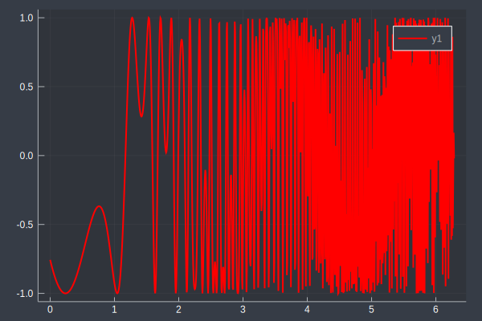

```julia
import Pkg;

# packages to install, first time can take a while downloading, please be patient..
packages=["Plots","PlotThemes"]

for package in packages
    println("getting package : ",package) 
    if get(Pkg.installed(),package,-1) == -1
        Pkg.add(package)
    end
end


# can take a while first time round, due to precompiling...
using Plots;
theme(:dark)
```


```julia
x = 0:2*pi/1000:2*pi
y = sin.(3*x + 4*cos.(1.02*x.^3.1))

plot(x, y, color="red", linewidth=2.0, linestyle=:solid)

```





